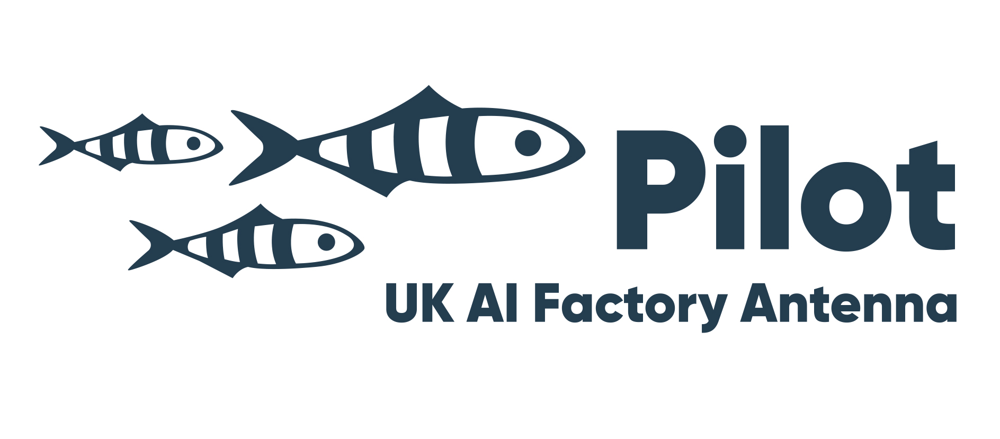

    
    
EPCC

    
    
Pilot-UKAIFA

<h2>Description</h2>

The aim of this workshop is to teach attendees how to train 
a model on the EIDF Cerebras CS-3 cluster, extract the weights
of the trained model, and run them on a system with different 
architecture (in this case, the EIDF GPU Cluster).

This workshop expands on the 
[Cerebras Modelzoo quickstar tutorial](https://training-docs.cerebras.ai/rel-2.10.0/getting-started/fine-tune-your-first-model)
and specifically looks at fine-tune a model to perform a new 
task.

<h2>Pre-requisites</h2>

Before getting started here are a few pre-requisites:

  * Access to the Cerebras cluster.
    * I also suggest following the Cerebras tutorial on 
      the EIDF documentation.
  * A HuggingFace account and access to the Llama2 family 
    of models.
    * Both are free, but access to the models needs to be 
      requested and approved (it shouldn't take too long, 
      I got approved roughly 30 min after requesting).
  * You may also want to follow the 
    [EIDF tutorials](https://getting-started-with-the-gpu-service-and-llms-fbe560.pages.eidf.ac.uk/#/?id=beginner39s-guide-to-eidf-navigating-the-gpu-service-and-kubernetes),
    and specifically the 
    [EIDF tutorial on fine tuning models](https://getting-started-with-the-gpu-service-and-llms-fbe560.pages.eidf.ac.uk/#/train?id=eidf-by-example).
    * A lot of the concepts and tool setup build on top of 
      those (kubernetes pods, persistent volume claims, 
      volume mounts, etc.)
    * The 
      [train_gsm8k.md](https://gitlab.eidf.ac.uk/epcc/ukaifa/-/tree/main)
      specifically has information about the dataset we will 
      use and how the evaluation is made.

<h2 id="general">General Information</h2>


  LOCATION

  This block displays the address and links to maps showing directions
  if the latitude and longitude of the workshop have been set.  You
  can use https://itouchmap.com/latlong.html to find the lat/long of an
  address.



  <strong>Where:</strong>
  {{page.address}}.
  Get directions with
  <a href="//www.openstreetmap.org/?mlat={{page.latlng | replace:',','&mlon='}}&zoom=16">OpenStreetMap</a>
  or
  <a href="//maps.google.com/maps?q={{page.latlng}}">Google Maps</a>.




  DATE

  This block displays the date and links to Google Calendar.



  <strong>When:</strong>
  {{page.humandate}}.
  




  SPECIAL REQUIREMENTS

  Modify the block below if there are any special requirements.


  <strong>Requirements:</strong> Participants must have an 
  account on the EIDF Cerebras Cluster. They are also 
  required to abide by the 
  <a href="https://edinburgh-international-data-facility.ed.ac.uk/about/policies/terms-and-conditions">EIDF Terms and Conitions of Access</a>.


  ACCESSIBILITY

  Modify the block below if there are any barriers to accessibility or
  special instructions.


  <strong>Accessibility:</strong> We are committed to making this workshop
  accessible to everybody.
  Where this workshop is taking place in person, the workshop organizers have checked that:

<ul>
  <li>The room is wheelchair / scooter accessible.</li>
  <li>Accessible restrooms are available.</li>
</ul>

  Materials will be provided in advance of the lesson and
  large-print handouts are available if needed by notifying the
  organizers in advance.  If we can help making learning easier for
  you (e.g. sign-language interpreters, lactation facilities) please
  get in touch (using contact details below) and we will
  attempt to provide them.


  CONTACT EMAIL ADDRESS

  Display the contact email address set in the configuration file.


  <strong>Contact</strong>:
  Please email
  
    
      
        or
      
        
        ,
        
      
      <a href='mailto:{{email}}'>{{email}}</a>
    
  
    to-be-announced
  
  for more information.

> ## Prerequisites
> You should have used remote HPC facilities before. In particular, you should be happy with connecting
> using SSH, know what a batch scheduling system is and be familiar with using the Linux command line.
> You should also be happy editing plain text files in a remote terminal (or, alternatively, editing them
> on your local system and copying them to the remote HPC system using `scp`).
{: .prereq}



